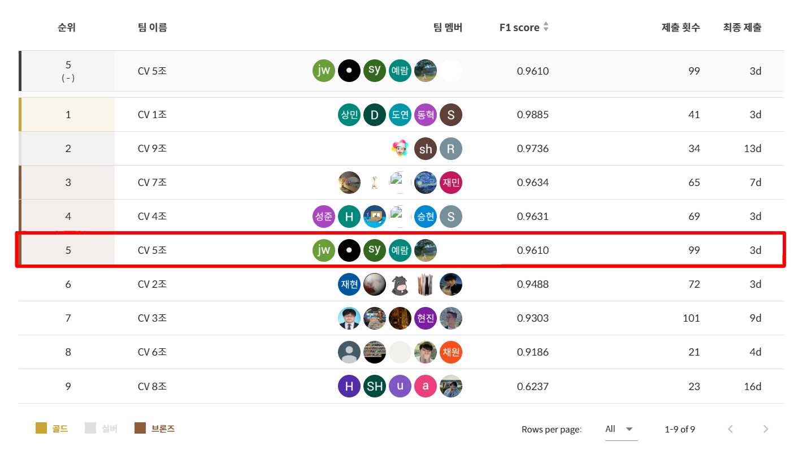
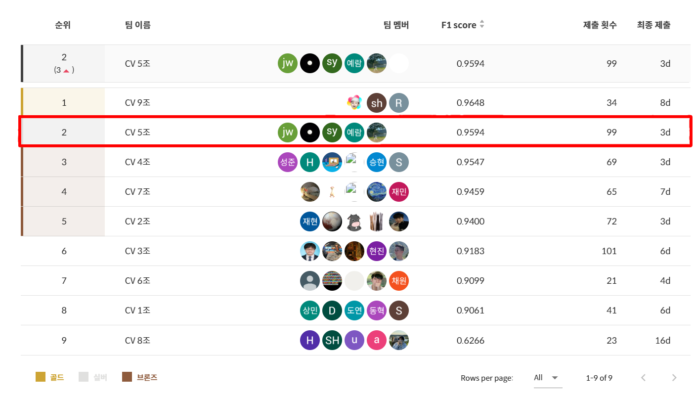

[](https://classroom.github.com/a/3DbKuh4a)
# Document Type Classification Competitions
## Team

| | |  |  | | |
| :--------------------------------------------------------------: | :--------------------------------------------------------------: | :--------------------------------------------------------------: | :--------------------------------------------------------------: | :--------------------------------------------------------------: | :--------------------------------------------------------------: |
|            [최장원](https://github.com/Jangonechoi)             |            [김영천](https://github.com/dudcjs2779)             |            [배창현](https://github.com/Bae-ChangHyun)             |            박성우             |            [조예람](https://github.com/huB-ram)             |            이소영B             |
|                            팀장                            |                            팀원(ME)                             |                            팀원                             |                            팀원                             |                            팀원                             |                            팀원                             |

## 1. Competitions Info
$\color{red}{\textsf{해당 대회의 Train/Test 데이터는 저작권 문제로 공개가 불가능해 설명을 위해 비슷한 이미지로 대체되어있음을 알려드립니다.}}$<br>
대회에서 실제 활용된 Train/Test에 가까운 데이터는 https://www.content.upstage.ai/ocr-pack/insurance 링크에서 확인해보실 수 있습니다.

### 1-1 Overview

해당 대회는 **Upstage AI Lab** 과정에서 비공개로 진행된 내부 대회이며 **다양한 문서를 분류하는 것이 주된 목적**입니다. 하지만 **자동차 계기판, 자동차 번호판** 같은 문서가 아닌 데이터, 그리고 **주민등록증, 여권**과 같은 일반적인 문서와는 조금 이질적인 데이터까지 포함돼 있는 특징이 있습니다. 또한 Train 데이터는 비교적 깨끗한 이미지가 주어지고 **Test 데이터에는 실데이터를 반영해** 다양한 노이즈가 포함된 이미지가 주어졌으며 이에 대응 가능한 모델을 학습시키는 것이 해당 대회의 핵심 포인트입니다.

### 1-2 Environment
Vscode, ssh server(RTX 3090/Ubuntu 20.04.6), pytorch

### 1-3 Timeline(2 weeks)
- February 05, 2024 - Start Date
- February 19, 2024 - Final submission deadline

### 1-4 Evaluation
  
평가지표는 macro f1 스코어로 **클래스 불균형**에도 신뢰성있는 점수를 제공하는 평가지표입니다.

## 2. Components

### 2-1 Directory

```
├─code
│    baseline_code_final.ipynb
│    rotnet_pytorch.ipynb
├─image
├─model
│    caformer_s18_sail_in22k_ft_in1k_384_loss_titlecrop02.pth
│    caformer_s18_sail_in22k_ft_in1k_384_rot.pth
└─ppt
     CV 05조 발표.pptx
```

## 3. Data descrption

### 3-1 Dataset overview

이번 대회는 computer vision domain에서 가장 중요한 태스크인 이미지 분류 대회입니다.

이미지 분류란 주어진 이미지를 여러 클래스 중 하나로 분류하는 작업입니다. 이러한 이미지 분류는 의료, 패션, 보안 등 여러 현업에서 기초적으로 활용되는 태스크입니다. 딥러닝과 컴퓨터 비전 기술의 발전으로 인한 뛰어난 성능을 통해 현업에서 많은 가치를 창출하고 있습니다.


그 중, 이번 대회는 문서 타입 분류를 위한 이미지 분류 대회입니다. 문서 데이터는 금융, 의료, 보험, 물류 등 산업 전반에 가장 많은 데이터이며, 많은 대기업에서 디지털 혁신을 위해 문서 유형을 분류하고자 합니다. 이러한 문서 타입 분류는 의료, 금융 등 여러 비즈니스 분야에서 대량의 문서 이미지를 식별하고 자동화 처리를 가능케 할 수 있습니다.

이번 대회에 사용될 데이터는 총 17개 종의 문서로 분류되어 있습니다. 1570장의 학습 이미지를 통해 3140장의 평가 이미지를 예측하게 됩니다. 특히, 현업에서 사용하는 실 데이터를 기반으로 대회를 제작하여 대회와 현업의 갭을 최대한 줄였습니다. 또한 현업에서 생길 수 있는 여러 문서 상태에 대한 이미지를 구축하였습니다.

이번 대회를 통해서 문서 타입 데이터셋을 이용해 이미지 분류를 모델을 구축합니다. 주어진 문서 이미지를 입력 받아 17개의 클래스 중 정답을 예측하게 됩니다. computer vision에서 중요한 backbone 모델들을 실제 활용해보고, 좋은 성능을 가지는 모델을 개발할 수 있습니다. 그 밖에 학습했던 여러 테크닉들을 적용해 볼 수 있습니다.

본 대회는 결과물 csv 확장자 파일을 제출하게 됩니다.

### 3-2 EDA


### 3-3 Augmentation
#### 3-3-1 Augraphy
<pre>
ink_phase = [
    InkBleed(intensity_range=(0.3, 0.6),
             kernel_size=random.choice([(5, 5), (3, 3)]),
             severity=(0.2, 0.6),
             p=0.5,),
    
    Hollow(hollow_median_kernel_value_range = (3, 10),
                hollow_min_width_range=(1, 3),
                hollow_max_width_range=(10, 15),
                hollow_min_height_range=(1, 3),
                hollow_max_height_range=(10, 15),
                hollow_min_area_range=(1, 3),
                hollow_max_area_range=(20, 50),
                hollow_dilation_kernel_size_range = (1, 2),
                p=1.0)
]

paper_phase = [
    OneOf([
        NoiseTexturize(sigma_range=(5, 20),
                        turbulence_range=(3, 10),
                        texture_width_range=(50, 500),
                        texture_height_range=(50, 500),
                        p=0.7),
        
        VoronoiTessellation(mult_range = (50, 80),
                            #seed = 19829813472,
                            num_cells_range = (500,1000),
                            noise_type = "random",
                            background_value = (170, 225),),
    ], p=1.0),
    
    BrightnessTexturize(texturize_range=(0.9, 0.99),
                        deviation=0.03,
                        p=0.4),
]

post_phase = [
    ShadowCast(shadow_side = "bottom",
                shadow_vertices_range = (2, 3),
                shadow_width_range=(0.5, 0.8),
                shadow_height_range=(0.5, 0.8),
                shadow_color = (0, 0, 0),
                shadow_opacity_range=(0.5,0.6),
                shadow_iterations_range = (1,2),
                shadow_blur_kernel_range = (101, 301),
                p=0.2),
]

pipeline = AugraphyPipeline(ink_phase=ink_phase, paper_phase=paper_phase, post_phase=post_phase)
</pre>


------
#### 3-3-2 Albumentation
<pre>
trn_transform = A.Compose([
    A.OneOf([
        # 비율을 유지하며 이미지 전체를 학습하기 위함
        A.Compose([
            A.LongestMaxSize(max_size=img_size, interpolation=cv2.INTER_CUBIC), # 가장 긴변을 img_size에 맞춤
            A.PadIfNeeded(min_height=img_size, min_width=img_size, border_mode=cv2.BORDER_CONSTANT, value=[255, 255, 255]), # 패딩
            A.OneOf([ # 회전 및 스케일링
                A.Rotate(limit=360, p=0.5, border_mode=cv2.BORDER_CONSTANT, value=[255, 255, 255]),
                A.RandomRotate90(p=0.2),
                A.ShiftScaleRotate(shift_limit=0.2, scale_limit=0.2, rotate_limit=360, p=0.3, border_mode=cv2.BORDER_CONSTANT, value=[255, 255, 255]),
            ], p=0.8),
            A.CoarseDropout (max_holes=6, max_height=96, max_width=96, min_holes=2, min_height=24, min_width=24, fill_value=0, p=0.2), # cutout
        ], p=0.6),
        
        # 문서의 제목을 학습하기 위함
        A.Compose([
            A.LongestMaxSize(max_size=640, interpolation=cv2.INTER_CUBIC),
            A.PadIfNeeded(min_height=640, min_width=640, border_mode=cv2.BORDER_CONSTANT, value=[255, 255, 255]),
            
            # Shift를 줘서 다양한 형태의 제목 이미지를 학습하기를 의도
            A.ShiftScaleRotate(shift_limit_x=0.2, shift_limit_y=(0.0, 0.1), scale_limit=0.2, rotate_limit=0, p=0.7, border_mode=cv2.BORDER_CONSTANT, value=[255, 255, 255]),
            A.Crop (x_min=128, y_min=0, x_max=128+384, y_max=384, p=1.0), # 윗쪽 중앙 크롭(대부분의 문서의 제목이 있는 위치)
            A.OneOf([
                A.Rotate(limit=360, p=0.7, border_mode=cv2.BORDER_CONSTANT, value=[255, 255, 255]),
                A.RandomRotate90(p=0.3),
            ], p=0.8),
        ], p=0.4)
    ], p=1.0),
    
    A.OneOf([
        A.RGBShift(r_shift_limit=10, g_shift_limit=10, b_shift_limit=10, p=0.6),
        A.ChannelShuffle(p=0.4),
    ], p=0.2),
    
    A.OneOf([A.MotionBlur(p=0.3), A.MedianBlur(blur_limit=3, p=0.3), A.Blur(blur_limit=3, p=0.4),], p=0.2), # 블러
    A.GaussNoise(var_limit=(30.0, 250.0), mean=0, per_channel=True, p=0.2), # 노이즈
    A.RandomBrightnessContrast (brightness_limit=(-0.3, 0.3), contrast_limit=(-0.3, 0.3), brightness_by_max=True, p=0.2), # 밝기
    A.OneOf([A.OpticalDistortion(p=0.5), A.PiecewiseAffine(scale=(0.01, 0.03), p=0.5)], p=1.0), # 구겨진 느낌
    A.HorizontalFlip(p=0.5),
    A.Normalize(mean=[0.485, 0.456, 0.406], std=[0.229, 0.224, 0.225], max_pixel_value=255),
    ToTensorV2(),
])
    
</pre>

### 3-4 TItle Crop


**confirmation_of_admission_and_discharge(입퇴원 확인서), medical_outpatient_certificate(통원/진료 확인서), statement_of_opinion(소견서)에 대한 혼동이 있었습니다.** 3가지의 문서의 형식이 매우 유사했고 가장 두드러진 차이를 보였던 문서의 제목부분을 Crop하여 학습해 성능을 높힐 수 있었습니다.


**문서의 제목을 크롭**하기 위해 이미지의 윗부분의 중앙을 Crop하여 학습에 사용했습니다. **거의 모든 이미지가 정방향으로 된 Train 셋과 달리 Test 셋은 그렇지 않았고** 때문에 Test 셋의 문서 제목을 Crop하기 위해 **문서 이미지를 정방향으로 회전시키는 모델**을 따로 학습하여 Test 셋의 이미지를 정방향으로 변환한뒤 추론을 진행했습니다. 이미지를 정방향으로 회전시키는 모델을 학습하는데 https://github.com/d4nst/RotNet 링크를 참고하였으며 **code/rotnet_pytorch.ipynb** 에서 코드를 확인하실 수 있습니다.

## 4. Modeling
### Used Model

caformer_s18_384([github](https://github.com/sail-sg/metaformer))

### Model descrition


최근에는 Vision Task에서도 **Transforemr 아키텍쳐 기반의 Vision 모델**들이 많이 등장하면서 기존의 Conv 기반의 모델보다 훨씬 좋은 성능을 내고 있고 그에 따라 Vision 모델들도 LLM과 같이 사이즈를 키우는 움직임을 보이며 성능도 비례해서 올라가고 있어 ImageNet Task에서의 상위권을 사이즈가 큰 모델들이 차지하고 있습니다. 하지만 이번 대회에서 제공받은 **GPU의 한계와 2주라는 짧은 시간**으로 인해 사이즈가 큰 모델을 사용하기 힘들다고 판단했고 **MetaFormer 아키텍쳐를 활용한 해당 모델**이 다른 Transformer 기반의 모델에 비해서 **성능도 1~2% 높으며 사이즈도 훨씬 작고 빠르게** 동작한다는 것을 발견했고 해당 모델을 선택하게 되었습니다.


여러가지 CAFormer 모델을 실험해보았고 loss 값이 좋았던 caformer_s18_384을 최종 모델로 선택했습니다.

### Modeling Process


## Ensemble & TTA
### None TTA confusion matrix of valid set


**Valid Accuracy: 0.94985**<br>
**Valid F1: 0.94912**

----------------------

### 20 Times TTA confusion matrix of valid set


**Valid Accuracy: 0.96902**<br>
**Valid F1: 0.96865**

## 5. Result

### Leader Board
#### Public Score


F1: 0.9610

------
#### Private Score


F1: 0.9594

### Presentation & Blog
- ppt 폴더참조  
- [대회회고](https://longing-artichoke-024.notion.site/Document-Type-Classification-Upstage-Competition-b786c611214d44618eaa663df2066819?pvs=4)

### Reference
- Focal Loss: https://github.com/mathiaszinnen/focal_loss_torch  
- CAFormer: https://github.com/sail-sg/metaformer  
- RotNet: https://github.com/d4nst/RotNet  

대회 데이터 참고용 링크: https://www.content.upstage.ai/ocr-pack/insurance
